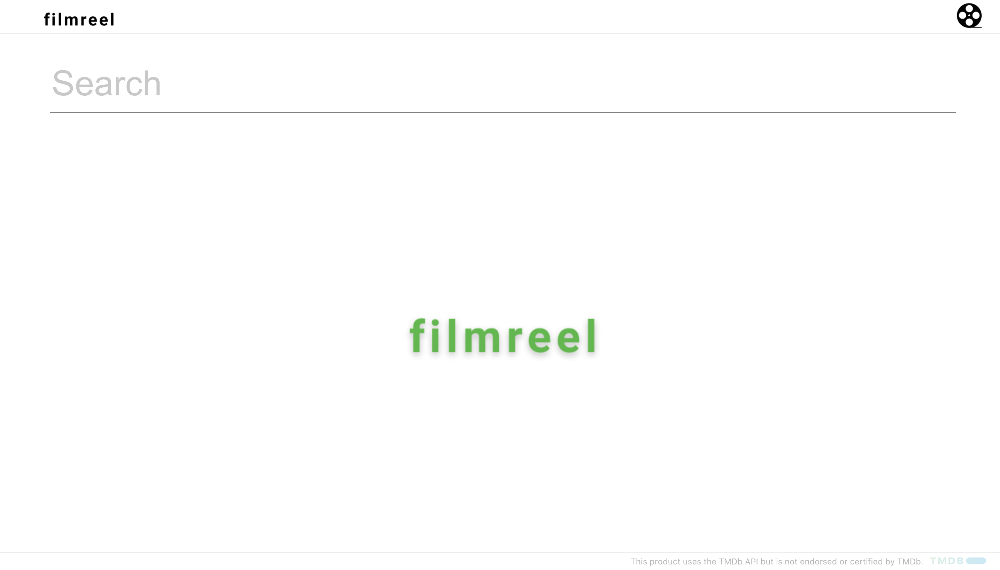
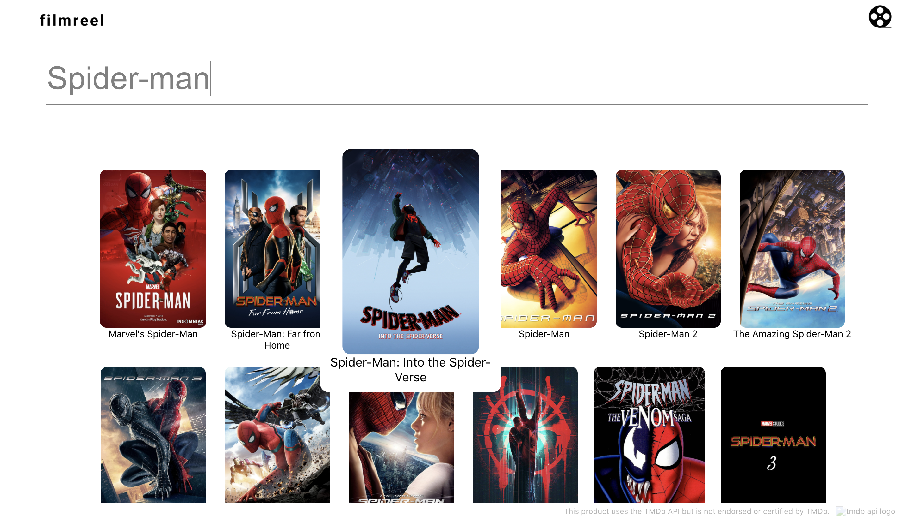

# Filmreel

Filmreel is an application tha allows you to search for movies, view their decriptions, and allow you to like them or dislike them. 

Live demo website: [https://film-reel.netlify.app/](https://film-reel.netlify.app/)

## Examples

## Installation

 In order to run this application you will need [node](https://nodejs.org/en/download/) and [npm](https://www.npmjs.com/get-npm) installed globally on your machine.

1. Install and run [rails backend](https://github.com/guillenjs/film-reel-backend)
2. Clone this repo and cd into file
3. Install dependencies
    ###### `$ npm install`
4. Start server
    ###### `$ npm start`
5. Visit application at
    ###### `localhost:3001`

## Tech Stack    
- Javascript
- React.js 
- Ruby on Rails API
- PostgreSQL
- CSS

## Tools
 - [TMDB api](https://developers.themoviedb.org/3/getting-started/introductiont)
 - [Styled components](https://styled-components.com/)
